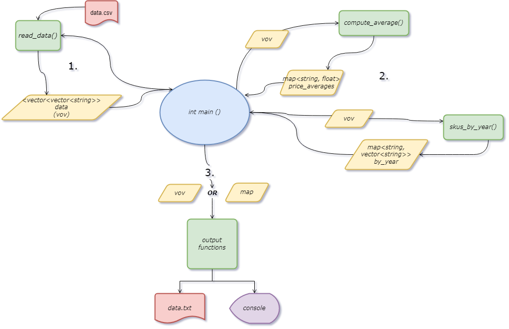

## Lab 1 - Objective

The objective of this assignment is to practice end-to-end programming skills of creating data transformation in C++ language as well as producing a program that will compile on targeted environment specified.

Sample code is provided to get you started with reading in a CSV formatted text file. While it complies, there are logical errors that currently render it useless. You are assigned to fix this program to support the requirements listed:

- Successfully reads all lines of the input file

- Writes to an output file

- Output contains these features

    - Feature 1: calculate the average price per brand, average price per category

    - Feature 2: for each unique year, list the count of SKUs and print out the SKUs as a list i.e., 2000 (3): 111, 211, 311 where it is a new line per year

- All programs must be able to compile in C++98 standard

- All programs must be able to run from the project root under your default `main` branch with the command `make lab1`

## Run Instructions

Assuming `g++` and `make` are present on our machine, all that is required to run the included code is to execute the command `make lab1` from the root directory of the repository. The `Makefile` is designed such that it will compile the code inside the `Lab-1` directory, then `cd` into it to ensure that the compiled binary has access to the `data.csv` file. The output file, `data.txt` will appear in the `Lab-1` directory as well.

## Problem Statement

The provided starter code:
- is able to read in from a `.csv` file, but it only reads every other line and does not correctly read in the Category and Price columns
- does not compute the averages (feature 1)
- does not create a listing of SKUs by year along with the count (feature 2)
- does not output anything to a file

## Solution

The source code in `file_in.cpp` was fixed to correctly provide the desired functionality as follows:
- The `ifstream` sequence which reads the `.csv` file has been modified:
    - Since the numericity of the data is only used for averages computation, each of the columns is stored as a `vector<string>`, which allows for to simplify the input data flow into one, central, all-encompassing `vector<vector<string>>` (henceforth: `vov`) data "frame". 
    - The read-in `while` loop reads one line at a time into a `stringstream`, from which each column (delimited by a comma) is properly stored into an appropriate `vector<string>`.
    - The above logic was separated into a separate function (`read_data()`) invoked by `main()`.
- Once `main()` obtains the vector of vectors with all the data from the `.csv` file, it can call other functions which will use the `vov` as a parameter:
    - `compute_average(data, col)` - accepts the `vov` as the `data` argument and an `int col` to indicate which column is to be treated as the criterion for price average computation. Two regular (ordered) `map`s are used; one (`<string, int>`) to keep track of the count of the criterion column's unique memebers' number of occurences, and the other - `<string, float>` - to maintaing a prices total. The price strings are parsed into floats (using the C++98 compatible C standard library function `atof()`) before placing into the map as values. The function returns a `map<string, float>` which maps unique members of the chosen column to their price averages (quotient of the value from the `price_total` map with value from the `count` map).
    - `skus_by_year(data)` - accepts the `vov` as the `data` argument and constructs a mapping of years to SKUs vector (`map<string, vector<string>>`). Returns this mapping.
- The results of the feature functions are sent by `main()` to output functions which iterate through the data structures (`vov` or `map`) and output the data (appropriately formatted) to the `data.txt` file.

The general flow of data can be seen on the following diagram:



## Expected Output:

The program is expected to produce a text file (`data.txt`) containing a formatted table with the full data from the .csv file, the price averages tables (by brand and by category), as well as the SKUs by year lines: 

```
SKU     Brand   Category        Year    Price
111       ABC          A        2000      0.5
112       LSM          B        2010      3.5
113       ABC          C        2020        5
121       LSM          D        2010      3.5
122       ZFT          B        2000      2.5
123       CDB          C        2010      4.5
211       ABC          A        2000      1.5
212       CDB          B        2010      1.5
213       ABC          C        2020      1.5
221       ABC          A        2000      1.5
222       CDB          C        2000      3.5
223       ZFT          D        2010      3.5
321       XYZ          A        2020      1.0
322       XYZ          A        2020      2.0
323       XYZ          A        2020      3.0

Brand          Average Price
  ABC                      2
  CDB                   3.17
  LSM                    3.5
  XYZ                      2
  ZFT                      3

Category       Average Price
       A                1.58
       B                 2.5
       C                3.62
       D                 3.5

Year      SKUs
2000 (5): 111, 122, 211, 221, 222
2010 (5): 112, 121, 123, 212, 223
2020 (5): 113, 213, 321, 322, 323
```